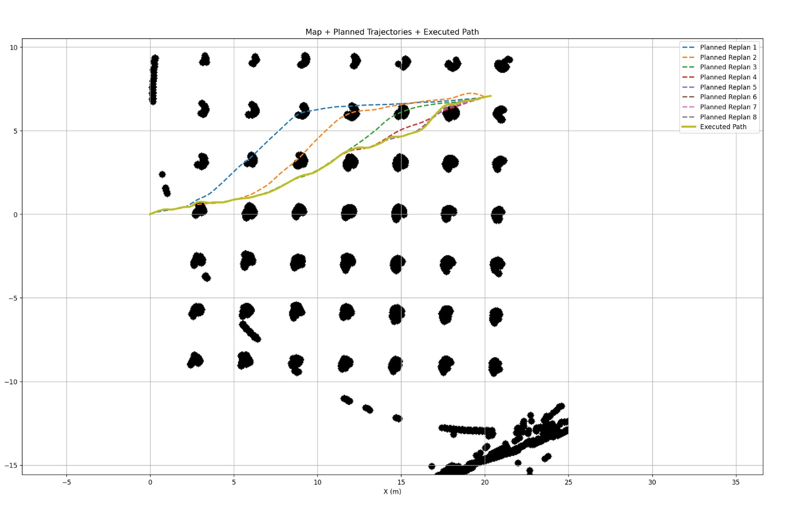
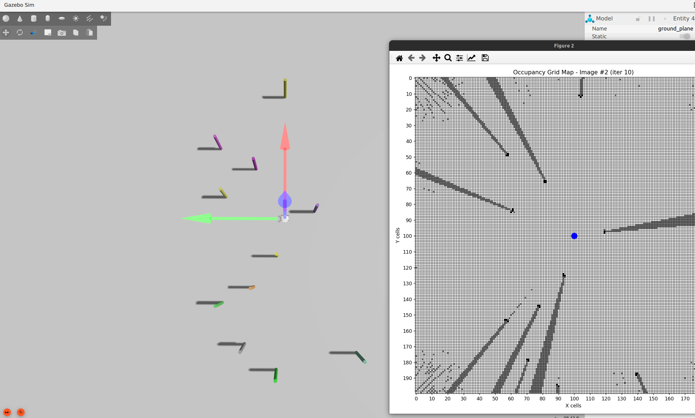
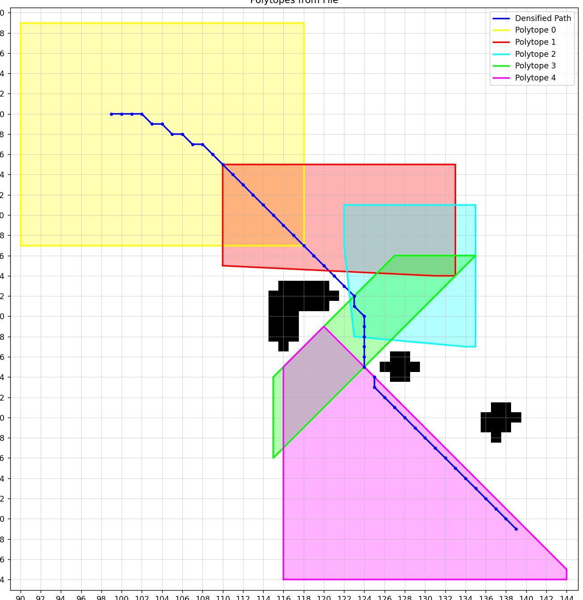
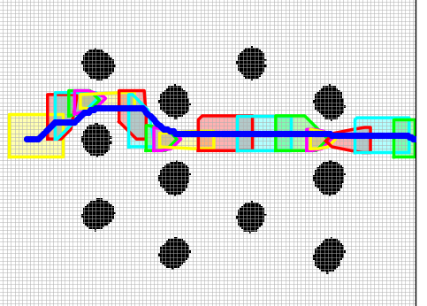
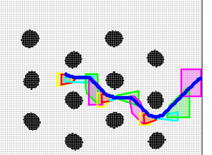

# minco-trajectory-planner
**Minco trajectory** planner is designed to generate smooth, dynamically feasible, and time-efficient trajectories for quadrotors in complex environments. It uses polynomial optimization to ensure continuity and low control effort while satisfying system constraints. The formulation is lightweight and efficient, making it suitable for real-time use even on low-cost, resource-constrained onboard computers. It also integrates well with control and planning modules for agile autonomous flight.


<p align="center">
  <!--  -->
  
  
  <!--  -->
</p>

<!-- Complete videos: 
[video1](https://www.youtube.com/watch?v=NvR8Lq2pmPg&feature=emb_logo),
[video2](https://www.youtube.com/watch?v=YcEaFTjs-a0), 
[video3](https://www.youtube.com/watch?v=toGhoGYyoAY). 
Demonstrations about this work have been reported on the IEEE Spectrum: [page1](https://spectrum.ieee.org/automaton/robotics/robotics-hardware/video-friday-nasa-lemur-robot), [page2](https://spectrum.ieee.org/automaton/robotics/robotics-hardware/video-friday-india-space-humanoid-robot),
[page3](https://spectrum.ieee.org/automaton/robotics/robotics-hardware/video-friday-soft-exoskeleton-glove-extra-thumb) (search for _HKUST_ in the pages).

-->

To run this project in minutes, check [Quick Start](#1-Quick-Start). Check other sections for more detailed information.

Please kindly star :star: this project if it helps you. We take great efforts to develope and maintain it :grin::grin:.


## Table of Contents

* [Quick Start](#1-Quick-Start)
* [Algorithms and Papers](#2-Algorithms-and-Papers)       <!-- * [Run Simulations](#4-run-simulations) -->
* [Use in Your Application](#3-use-in-your-application)
<!-- * [Known issues](#known-issues) -->


## 1. Quick Start

This project has been tested on Ubuntu 22.04(ROS Humble) .

Firstly, you should install the following required libraries:

Eigen3
Ompl
Octopmap

```
  sudo apt-get update && sudo apt-get install -y \
  libeigen3-dev \
  ros-humble-octomap-ros \
  ros-humble-ompl
```

Then simply clone and compile our package (using ssh here):

```
git clone git@github.com:RishabhChandrakar/minco-trajectory-planner.git
cd minco-trajectory-planner
colcon build
```

You may check the detailed [instruction](#3-setup-and-config) to setup the project. 

After compilation you can start a simulation (run in a new terminals): 
```
source install/setup.bash && ros2 launch planner planner_simulation.launch
```

<!-- You will find the random map and the drone in ```Rviz```. You can select goals for the drone to reach using the ```2D Nav Goal``` tool. A sample simulation is showed [here](#demo1). -->


## 2. Algorithms and Papers

<!-- The project contains a collection of robust and computationally efficient algorithms for quadrotor fast flight:
* Kinodynamic path searching
* B-spline-based trajectory optimization
* Topological path searching and path-guided optimization
* Perception-aware planning strategy (to appear)

These methods are detailed in our papers listed below. 

Please cite at least one of our papers if you use this project in your research: [Bibtex](files/bib.txt).

- [__Robust and Efficient Quadrotor Trajectory Generation for Fast Autonomous Flight__](https://ieeexplore.ieee.org/document/8758904), Boyu Zhou, Fei Gao, Luqi Wang, Chuhao Liu and Shaojie Shen, IEEE Robotics and Automation Letters (**RA-L**), 2019.
- [__Robust Real-time UAV Replanning Using Guided Gradient-based Optimization and Topological Paths__](https://arxiv.org/abs/1912.12644), Boyu Zhou, Fei Gao, Jie Pan and Shaojie Shen, IEEE International Conference on Robotics and Automation (__ICRA__), 2020.
- [__RAPTOR: Robust and Perception-aware Trajectory Replanning for Quadrotor Fast Flight__](https://arxiv.org/abs/2007.03465), Boyu Zhou, Jie Pan, Fei Gao and Shaojie Shen, IEEE Transactions on Robotics (__T-RO__). 

-->

All planning algorithms along with other key modules, such as mapping, sfc generation are implemented in __minco-trajectory-planner__:

- __mapping__: The online mapping algorithms. The map is built using 2D LiDAR data from the `/scan` topic along with odometry. It takes in raw scan data of 2-D Lidar  and lidar pose (odometry) pairs as input, do raycasting to update a probabilistic volumetric map, and build an occupancy grid map for the planning system. We maintain a local occupancy grid centered around the drone, where each cell stores the belief of being occupied. 

<p align="center">
  <!--  -->
  
  <!--  -->
  <!--  -->
</p>

- __sfc_generation__: This module consists of  a Safe Flight Corridor (SFC) generation pipeline that converts obstacle-rich space into convex polytopes, using seed voxel extraction, rectangle expansion, QuickHull Algorithms . A dedicated C++ CorridorBuilder module then assembles and merges these polytopes along the A-star generated path to form a continuous safe corridor for trajectory optimization.

<p align="center">
   
  
  
  <!--  -->
</p>

- __minco_planner__: It includes the core MINCO-based trajectory optimization modules, covering differential flatness, trajectory parameterization, and nonlinear optimization. The implementation integrates supporting components such as geometric utilities, root finding, convex decomposition (QuickHull), and optimization solvers (LBFGS, SDLP) to generate smooth, dynamically feasible, and collision-free trajectories within the safe corridors.

- __plan_manage__: High-level modules that schedule and call the mapping and planning algorithms. Interfaces for launching the whole system, as well as the configuration files are contained here.

- __system_node__: This is the main ROS node that integrates, schedules, and calls the mapping, corridor generation, and planning algorithms. It handles real-time replanning by regenerating trajectories when new obstacles are detected and manages the overall system execution.

The full pipeline is validated in simulation (Gazebo–ROS–ArduPilot SITL) 

<p align="center">
  <!--  -->
  
  
  <!--  -->
</p>

as well as on hardware with an F450 quadrotor running on a Raspberry Pi 4.

<p align="center">
  <!--  -->
  
  <!--  -->
  <!--  -->
</p>

<p align="center">
  <!--  -->
  
  <!--  -->
  <!--  -->
</p>

## 3. Use in Your Application

<!-- If you have successfully run the simulation and want to use __minco-trajectory-planner__ in your project,
please explore the files kino_replan.launch or topo_replan.launch.
Important parameters that may be changed in your usage are contained and documented.

Note that in our configuration, the size of depth image is 640x480. 
For higher map fusion efficiency we do downsampling (in kino_algorithm.xml, skip_pixel = 2).
If you use depth images with lower resolution (like 256x144), you might disable the downsampling by setting skip_pixel = 1. Also, the _depth_scaling_factor_ is set to 1000, which may need to be changed according to your device.

Finally, for setup problem, like compilation error caused by different versions of ROS/Eigen, please first refer to existing __issues__, __pull request__, and __Google__ before raising a new issue. Insignificant issue will receive no reply.

-->

## 4. Parameters

The ROS implementation exposes several parameters:

|Parameter|Definition|Default|
|---|---|---|
|`GRID_W/GRID_H`|It defines the width/height of the world map being made for the trajectory planning .|50.0 m|
|`RES`|Resolution of the map.|0.05 m|
|`TAKEOFF_ALTITUDE`|It defines the altitude at which the drone will fly.|1.5 m|
|`drone_radius_cm_`|Drone's Radius in centimeters, required to inflate the actual map .|35 cm|
|`lookahead_time_`| It is the amount of time in seconds , for which planner will look after that much seconds.|2 sec|
|`max_vel_`|It is the maximum velocity drone can fly .|0.5 m/s|
|`pipeline_step_duration_`|It is the main timer that determines how often the main loop checks the safety of the current trajectory and generates a new trajectory if required.|0.2 s|

